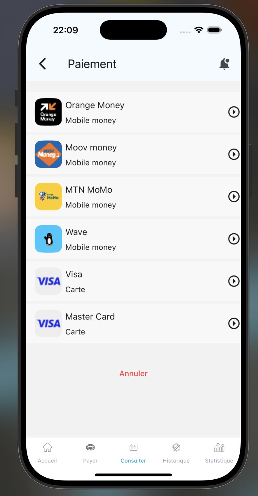
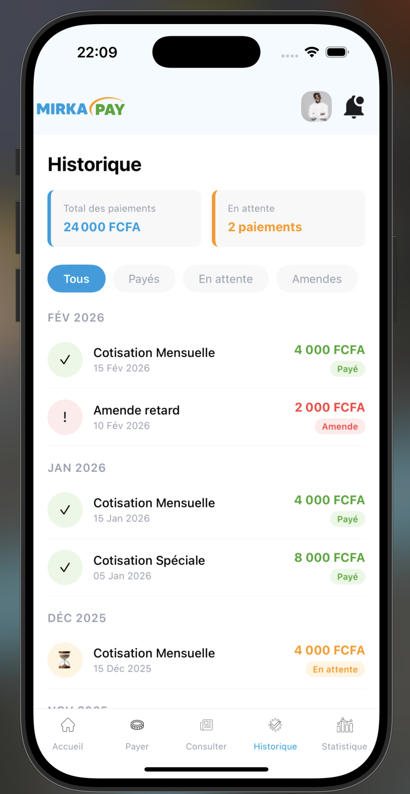
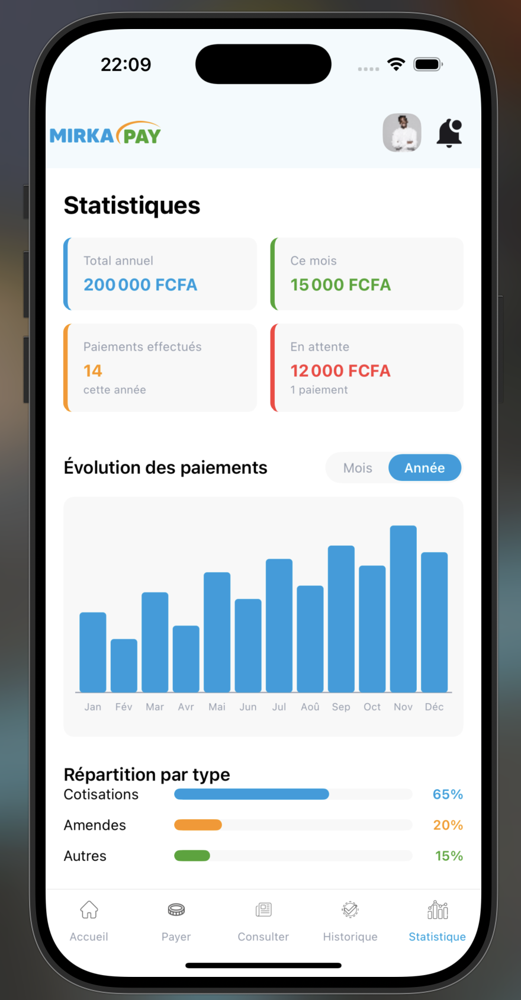
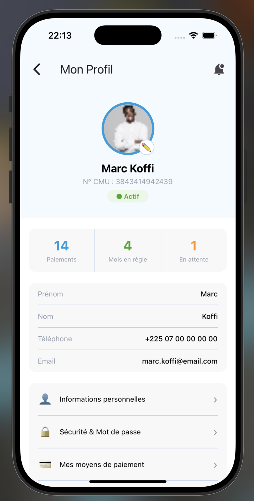
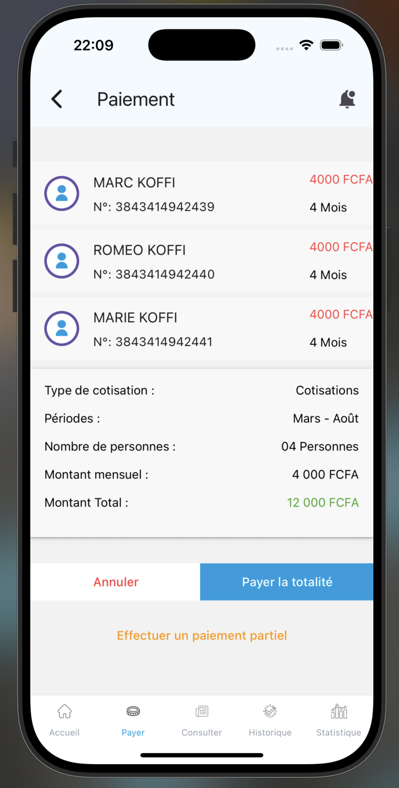
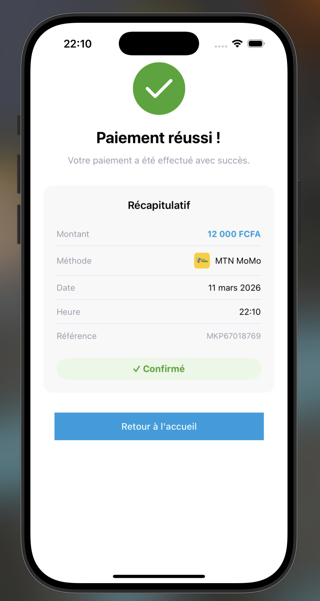
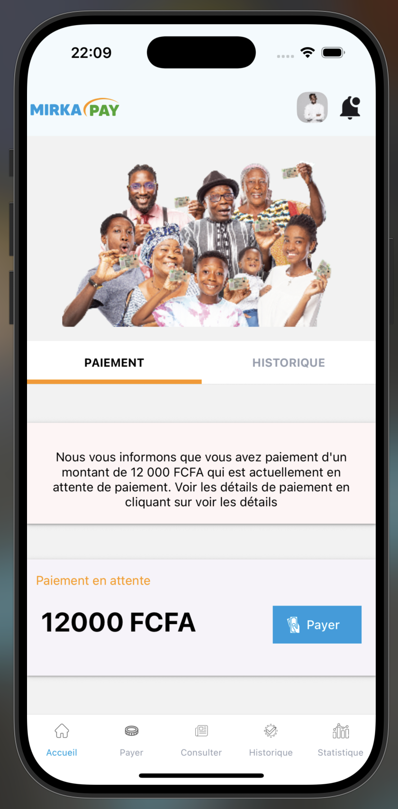
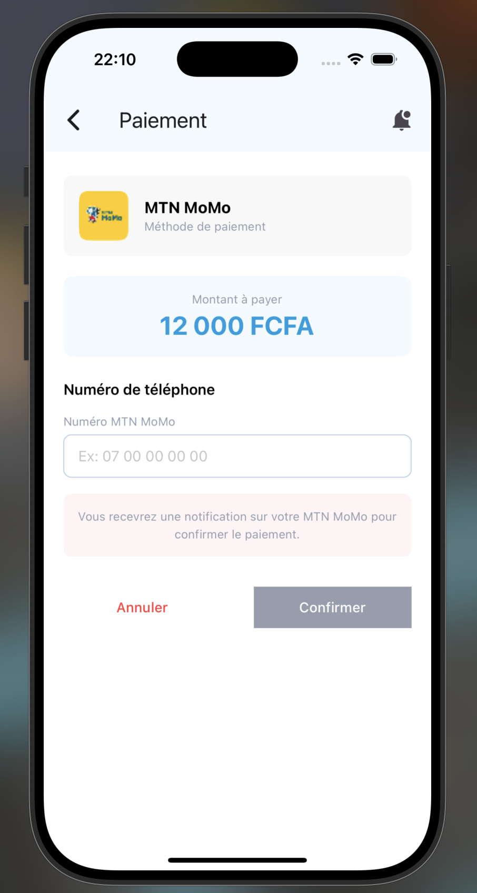

# MirkaPay


> **⚠️ POC — Proof of Concept**
> Ce projet est une démonstration technique (preuve de concept). Les données sont fictives, aucun paiement réel n'est effectué et aucune API backend n'est connectée. L'objectif est d'illustrer les flux de navigation, les interfaces utilisateur et l'architecture d'une application de paiement mobile CMU.

Application mobile de paiement des cotisations CMU (Couverture Maladie Universelle), développée avec React Native et Expo.

---

## Sommaire

- [Aperçu](#aperçu)
- [Screenshots](#screenshots)
- [Tech Stack](#tech-stack)
- [Prérequis](#prérequis)
- [Installation](#installation)
- [Architecture](#architecture)
- [Navigation](#navigation)
- [Écrans](#écrans)
- [Composants](#composants)
- [Palette de couleurs](#palette-de-couleurs)
- [Conventions de code](#conventions-de-code)
- [Licence](#licence)

---

## Aperçu

MirkaPay permet aux assurés CMU de :
- Consulter et payer leurs cotisations en attente
- Choisir leur méthode de paiement (Orange Money, Moov, MTN MoMo, Wave, Visa, Mastercard)
- Suivre leur historique de paiements
- Visualiser leurs statistiques de cotisations
- Gérer leur profil

---

## Screenshots

<!-- Ajouter les captures dans assets/screenshots/ -->

| Accueil | Paiement | Historique | Statistiques |
|---|---|---|---|
|  |  |  |  |

| Connexion | Profil | Détail paiement | Confirmation |
|---|---|---|---|
|  |  |  |  |

| Home | Formulaire de paiement |
|---|---|
|  |  |

---

## Tech Stack

| Outil | Version | Rôle |
|---|---|---|
| React Native | 0.74.5 | Framework mobile |
| Expo | ~51.0.28 | Toolchain & build |
| Expo Router | ~3.5.23 | Routing fichier |
| React Navigation | 6.x | Navigation stack & tabs |
| React Native Paper | ^5.12.5 | UI components (Cards, TextInput…) |
| React Native SVG | ^15.7.1 | Icônes & graphiques |
| React Native Safe Area Context | 4.10.5 | Gestion des encoches |
| TypeScript | ~5.3.3 | Typage statique |

---

## Prérequis

- **Node.js** >= 18
- **npm** >= 9 (ou yarn)
- **Expo Go** installé sur votre appareil iOS ou Android ([App Store](https://apps.apple.com/app/expo-go/id982107779) / [Play Store](https://play.google.com/store/apps/details?id=host.exp.exponent))
- Pour émulateur : Android Studio (Android) ou Xcode (iOS, macOS uniquement)

---

## Installation

```bash
# Installer les dépendances
npm install

# Lancer l'application
npx expo start
```

Puis scanner le QR code avec **Expo Go** (iOS / Android), ou lancer sur émulateur :

```bash
npx expo start --android
npx expo start --ios
```

---

## Architecture

```
mirkapay/
├── app/
│   ├── index.tsx                  # Stack Navigator principal (point d'entrée)
│   ├── _layout.tsx                # Layout Expo Router racine
│   ├── constants/
│   │   └── colors.ts              # Palette de couleurs globale
│   └── components/
│       ├── screens/               # Écrans de l'application
│       │   ├── FirstScreen.tsx    # Écran d'accueil / splash
│       │   ├── Connexion.tsx      # Login + tab Inscription
│       │   ├── Register.tsx       # Inscription multi-étapes
│       │   ├── ForgotPassword.tsx # Réinitialisation mot de passe
│       │   ├── Home.tsx           # Accueil (TopTab Paiement / Historique)
│       │   ├── HistoriqueScreen.tsx
│       │   ├── StatistiqueScreen.tsx
│       │   ├── Profile.tsx        # Profil utilisateur
│       │   ├── PaymentDetail.tsx  # Détail du paiement en attente
│       │   ├── PaymentMode.tsx    # Choix de la méthode de paiement
│       │   ├── PaymentForm.tsx    # Saisie des informations de paiement
│       │   └── PaymentSuccess.tsx # Confirmation du paiement
│       └── widgets/               # Composants réutilisables
│           ├── Header.tsx         # Barre de navigation supérieure
│           ├── BottomTab.tsx      # Navigation par onglets (5 tabs)
│           ├── Tobtab.tsx         # Navigation par onglets supérieurs
│           ├── Cards.tsx          # Cartes (CardInfo, PayCard, CardDetail…)
│           ├── Button.tsx         # Boutons (MyButton, ButtonText)
│           ├── Logo.tsx           # Logos MIRKAPAY & CNAM
│           ├── ColoredLogo.tsx    # Logo coloré header
│           ├── Pagination.tsx     # Indicateur de pagination
│           ├── Account.tsx        # Icône compte SVG
│           ├── House.tsx          # Icône accueil SVG
│           ├── Coin.tsx           # Icône payer SVG
│           ├── Consulter.tsx      # Icône consulter SVG
│           ├── Historique.tsx     # Icône historique SVG
│           ├── Statistique.tsx    # Icône statistiques SVG
│           └── PaymentLogo.tsx    # Icône paiement SVG
├── assets/
│   ├── images/                    # Images & logos (orange, moov, mtn, wave, visa…)
│   └── screenshots/               # Captures d'écran (pour le README)
├── package.json
└── tsconfig.json
```

---

## Navigation

### Structure globale

```
Stack Navigator (index.tsx)
│
├── FirstScreen          ← Splash / Onboarding
│
├── ── Authentification ──
├── Login                ← TopTab (Connexion | Inscription)
├── Register             ← Inscription multi-étapes (3 étapes)
├── ForgotPassword       ← Réinitialisation mot de passe (3 étapes)
│
├── ── Application ──
├── Home (BottomTab)
│   ├── Accueil          ← TopTab (Paiement | Historique)
│   ├── Payer
│   ├── Consulter
│   ├── Historique       ← HistoriqueScreen
│   └── Statistique      ← StatistiqueScreen
│
├── Profile
│
└── ── Flow Paiement ──
    ├── PaymentDetail    ← Détail + membres
    ├── PaymentMode      ← Choix méthode
    ├── PaymentForm      ← Saisie (téléphone ou carte)
    └── PaymentSuccess   ← Confirmation + récapitulatif
```

### Flows détaillés

**Authentification**
```
FirstScreen → [CONNEXION]   → Login → Home
            → [INSCRIPTION] → Register (étape 1→2→3) → Login

Login → [Mot de passe oublié ?] → ForgotPassword (étape 1→2→3) → Login
      → [INSCRIPTION]           → Register
```

**Paiement**
```
Home (tab Paiement) → [Payer] → PaymentDetail
PaymentDetail → [Payer la totalité] → PaymentMode
PaymentMode   → [Méthode]           → PaymentForm
PaymentForm   → [Confirmer]         → PaymentSuccess
PaymentSuccess → [Retour accueil]   → Home (reset pile)
```

**Profil**
```
Header (photo) → Profile → [Retour] → écran précédent
Profile → [Se déconnecter] → FirstScreen (reset pile)
```

---

## Écrans

| Écran | Description |
|---|---|
| `FirstScreen` | Splash avec image de fond, boutons Connexion & Inscription |
| `Login` | TopTab avec onglets Connexion et Inscription |
| `Register` | Formulaire multi-étapes : infos personnelles → coordonnées → mot de passe |
| `ForgotPassword` | Réinitialisation : identification → OTP SMS → nouveau mot de passe |
| `Home` | Tableau de bord avec paiement en attente et historique rapide |
| `HistoriqueScreen` | Liste filtrée des paiements groupés par mois |
| `StatistiqueScreen` | Graphiques, répartition par type, derniers paiements |
| `Profile` | Infos utilisateur, stats, menu paramètres, déconnexion |
| `PaymentDetail` | Détail du paiement : membres, montants, récapitulatif |
| `PaymentMode` | Sélection de la méthode de paiement |
| `PaymentForm` | Saisie numéro mobile ou informations de carte bancaire |
| `PaymentSuccess` | Confirmation avec référence, date, méthode utilisée |

---

## Composants

### Widgets réutilisables

| Composant | Props principales | Description |
|---|---|---|
| `Header` | `img`, `secondIcon`, `onPressProfile` | Barre supérieure avec logo, avatar et icône |
| `HeaderWithText` | `title`, `icon`, `onChange` | Barre avec bouton retour |
| `BottomTab` | `actif` | Navigation 5 onglets |
| `TopTab` | `firstTitle`, `secondTitle`, `firstComponent`, `secondComponent` | Onglets supérieurs Material |
| `MyButton` | `text`, `color`, `textColor`, `size`, `onChange`, `icon` | Bouton principal |
| `ButtonText` | `text`, `textColor`, `onChange` | Bouton texte |
| `CardInfo` | `title`, `content`, `color`, `top` | Carte d'information |
| `PayCard` | `title`, `content`, `buttonText`, `color`, `onChange` | Carte de paiement |
| `CardDetail` | `title`, `sub`, `icon`, `amount`, `month` | Ligne de détail membre |
| `CardGeneral` | — | Récapitulatif de cotisation |
| `CardMethod` | `title`, `sub`, `img`, `icon`, `onChange` | Ligne de méthode de paiement |
| `Input` | `text`, `color`, `value`, `onChangeText`, `keyboardType` | Champ texte |
| `SecureInput` | `text`, `color`, `value`, `onChangeText` | Champ mot de passe |

---

## Palette de couleurs

| Nom | Hex | Usage |
|---|---|---|
| `blue` | `#009DDF` | Couleur principale, boutons, accents |
| `orange` | `#FF9403` | Actions secondaires, alertes |
| `green` | `#41A52A` | Succès, paiements effectués |
| `red` / `lightRed` | `#FD3A3A` / `#FF4040` | Erreurs, annulations, amendes |
| `skyBlue` | `#BBD1EB` | Bordures, séparateurs |
| `lightBlue` | `#F2FAFD` | Fonds de sections |
| `lightGrey` | `#959DAD` | Textes secondaires, labels |
| `CloudGrey` | `#F8F8F8` | Fonds de cartes |
| `lightPink` | `#FFF5F5` | Fonds d'alertes douces |
| `white` | `#FFFFFF` | Fonds principaux |
| `dark` | `#000000` | Textes principaux |

---

## Conventions de code

- **Langage** : TypeScript strict
- **Styling** : `StyleSheet.create` (React Native natif) — NativeWind non utilisé pour éviter les conflits avec react-native-paper
- **Composants UI** : react-native-paper pour les éléments interactifs (Button, TextInput, Cards)
- **Icônes** : composants SVG custom via react-native-svg (pas de bibliothèque d'icônes externe)
- **Couleurs** : toujours utiliser les tokens de `app/constants/colors.ts`, jamais de valeurs en dur

---

## Licence

Ce projet est un POC à usage démonstratif. Tous droits réservés.